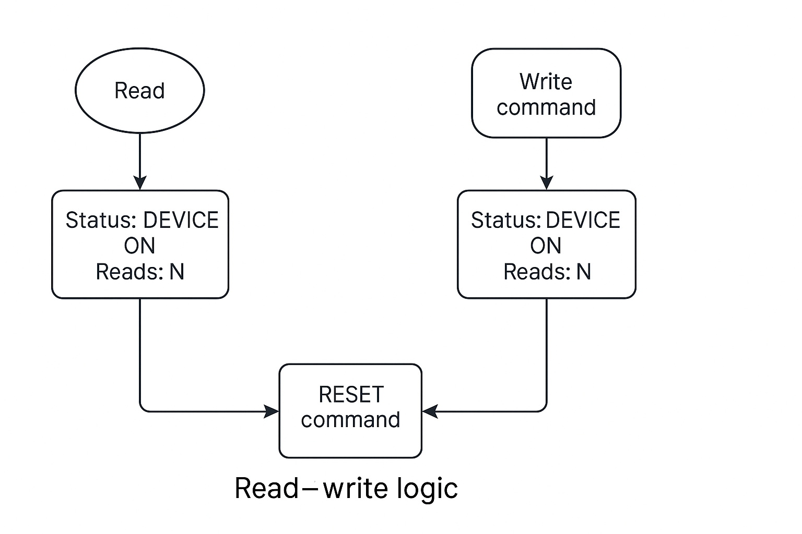

# Simple Character Driver Practice – Read Counter and RESET Command

This kernel module is a basic Linux character device driver created for practice. When loaded, it registers a character device named `driver_practice`, which can be accessed through a device file (e.g., `/dev/new_char_driver`).

The main feature of this module is that it keeps track of how many times the device has been read, and it updates the device status based on write commands.

### How it works

* Every time the device is **read** (using `cat`), it returns a message like:

  ```
  Status: DEVICE ON
  Reads: <number>
  ```

  The `Reads` counter increments with each read operation, allowing you to see how many times the device has been accessed.

* You can also send specific **commands** to the device by writing to it. For example:

  ```bash
  echo "RESET" > /dev/new_char_driver
  ```

  This command resets the read counter to `0` and updates the internal status to `DEVICE RESET`. However, when reading again, it will display "DEVICE ON" because the read operation always sets the status to that message.

### Example session

```bash
$ cat /dev/new_char_driver
Status: DEVICE ON
Reads: 0

$ cat /dev/new_char_driver
Status: DEVICE ON
Reads: 1

$ echo "RESET" > /dev/new_char_driver

$ cat /dev/new_char_driver
Status: DEVICE ON
Reads: 0
```

This practice module helps understand how read/write operations work in character drivers, how to communicate from user space to kernel space using `copy_from_user()` and `copy_to_user()`, and how to maintain internal device state.


